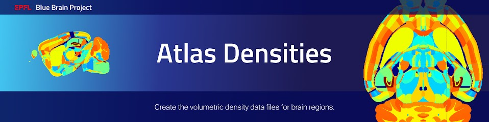

|banner|

Overview
=========

This project contains the tools to create the `BBP Cell Atlas`_, using datasets from the
`Allen Institute for Brain Science (AIBS)`_ and collected literature density values.
The AIBS datasets files were obtained via experiments performed on P56 wild-type mouse brains.
The outcome of this project is a list of volumetric files that provides cell type density estimates
for each voxel of the mouse brain volume. The BBP Cell Atlas is the first model required to
reconstruct BBP circuits of the mouse brain.

The tools implementation is based on the methods of `Eroe et al. (2018)`_, `Rodarie et al. (2022)`_,
and `Roussel et al. (2022)`_.

The source code was originally written by Csaba Eroe, Dimitri Rodarie, Hugo Dictus, Lu Huanxiang,
Wojciech Wajerowicz, Jonathan Lurie, and Yann Roussel.

The tools allow to:

* combine AIBS annotation files to reinstate missing mouse brain regions
* combine several AIBS gene marker datasets, to be used as hints for the spatial distribution of glial cells
* compute cell densities for several cell types including neurons and glial cells in the whole mouse brain

Tools can be used through a command line interface.

After installation, you can display the available command lines with the following ``bash`` command:

.. code-block:: bash

    atlas-densities --help

Installation
============

.. code-block:: bash

    git clone https://github.com/BlueBrain/atlas-densities
    cd atlas-densities
    pip install -e .

cgal-pybind
-----------
This project depends on the BBP python project cgal-pybind_.
The python project cgal-pybind_ needs to be installed prior to the above instructions.

Examples
========

Note: Depending on the size and resolution of the atlas, it can happen that some of the examples may not run with the 25um atlas from the Allen Institute due to memory requirements.  For instance, 8GB of memory is often not enough for the "Combine ISH datasets for glia cells", depending on the datasets being combined.

Reference atlases
-----------------

Most the pipeline steps rely on the following AIBS reference datasets (see `Rodarie et al. (2022)`_ for more
details on the different versions of these datasets):

* A Nissl volume
* An annotation volume
* A brain region hierarchy file

The AIBS Nissl reference volume is derived from high resolution image stacks of Nissl-stained
coronal brain slices. These images are realigned and arranged to form a 3D brain volume. Nissl
stains each cell somas. The intensity of each voxel of the Nissl volume correlates with the number
of cells in this voxel. This Nissl volume has a corresponding annotation volume which maps each
voxel of the Nissl volume to a brain region. The AIBS organize brain regions in a hierarchical tree,
with leaves representing the finest parcellation.

These datasets are publicly available on the AIBS website.

Download reference atlases
~~~~~~~~~~~~~~~~~~~~~~~~~~

Make `data` directory, and download needed annotation volumes, Nissl volume and hierarchy file:

.. code-block:: bash

   mkdir -p data/ccfv2 data/ccfv3

   # hierarchy file:
   curl -o data/1.json http://api.brain-map.org/api/v2/structure_graph_download/1.json
   # also available in atlas_densities/app/data/1.json

   # CCFv2 annotation volumes:
   curl -o data/ccfv2/annotation_25.nrrd http://download.alleninstitute.org/informatics-archive/current-release/mouse_ccf/annotation/mouse_2011/annotation_25.nrrd
   curl -o data/ccfv2/annotation_fibers_25.nrrd http://download.alleninstitute.org/informatics-archive/current-release/mouse_ccf/annotation/mouse_2011/annotationFiber_25.nrrd

   # CCFv3 annotation volume:
   curl -o data/ccfv3/annotation_25.nrrd http://download.alleninstitute.org/informatics-archive/current-release/mouse_ccf/annotation/ccf_2017/annotation_25.nrrd

   # AIBS Nissl volume:
   curl -o data/ccfv2/ara_nissl_25.nrrd http://download.alleninstitute.org/informatics-archive/current-release/mouse_ccf/ara_nissl/ara_nissl_25.nrrd

Preparation of the annotation volume
~~~~~~~~~~~~~~~~~~~~~~~~~~~~~~~~~~~~

Depending on the chosen version for the reference volumes pairs, some additional preparation
are needed.

The ccfv2 annotations are split into two volumes. One describes solely the fibers and
ventricular related regions while the other contains all other brain regions.
If you choose the ccfv2 version to estimate cell densities, then you should combine these two datasets:

.. code-block:: bash

    # Here we override the ccfv2 annotation_25.nrrd file
    atlas-densities combination combine-ccfv2-annotations             \
        --brain-annotation-ccfv2=data/ccfv2/annotation_25.nrrd        \
        --fiber-annotation-ccfv2=data/ccfv2/annotation_fibers_25.nrrd \
        --output-path=data/ccfv2/annotation_25.nrrd

The ccfv3 annotation volume is more smooth but lacks a few brain parcellations that were present in
the ccfv2 counterpart. If you choose the ccfv3 version to estimate cell densities, you can extend
the ccfv3 annotation atlas with annotations of ccfv2.

.. code-block:: bash

    # Here we override the ccfv3 annotation_25.nrrd file
    atlas-densities combination combine-v2-v3-annotations             \
        --hierarchy-path=data/1.json                                  \
        --brain-annotation-ccfv2=data/ccfv2/annotation_25.nrrd        \
        --fiber-annotation-ccfv2=data/ccfv2/annotation_fibers_25.nrrd \
        --brain-annotation-ccfv3=data/ccfv3/annotation_25.nrrd        \
        --output-path=data/ccfv3/annotation_25.nrrd

In the following examples, we will use the ccfv2 reference atlases.

`In situ` hybridization datasets
--------------------------------

Download, realign and interpolate AIBS ISH datasets
~~~~~~~~~~~~~~~~~~~~~~~~~~~~~~~~~~~~~~~~~~~~~~~~~~~

The BBP Cell Atlas pipeline leverages `in situ` hybridization (ISH) volumetric datasets from the AIBS
to estimate cell type densities in all regions of the mouse brain. These ISH datasets have to be
realigned to the Nissl reference volume.

The DeepAtlas_ toolkit allows you to download AIBS ISH image stacks, align these images to the Nissl
volume, and interpolate between them to create volumetric ISH datasets for each gene of your interest.

Combine ISH datasets for glia cells
~~~~~~~~~~~~~~~~~~~~~~~~~~~~~~~~~~~

Glial cells express many genetic markers but none is expressed by every glial cells.
We combine here `in situ` hybridization (ISH) volumetric datasets for glia markers and compute the
glia subtypes global scaling factors, as described in `Eroe et al. (2018)`_.
The list of required genes to combine for the generic glia marker can be found at
`combine_markers_ccfv2_config.yaml`_.

.. code-block:: bash

    atlas-densities combination combine-markers         \
        --hierarchy-path=data/1.json                    \
        --annotation-path=data/ccfv2/annotation_25.nrrd \
        --config=atlas_densities/app/data/markers/combine_markers_ccfv2_config.yaml

ISH datasets for inhibitory/excitatory neurons
~~~~~~~~~~~~~~~~~~~~~~~~~~~~~~~~~~~~~~~~~~~~~~

In `Eroe et al. (2018)`_ (i.e., BBP Cell Atlas version 1), the excitatory neurons are distinguished
from the inhibitory neurons using the Nrn1 and GAD67 (or GAD1) genetic marker.

In `Rodarie et al. (2022)`_ (i.e., BBP Cell Atlas version 2), the authors used parvalbumin (Pvalb),
somatostatin (SST), vasoactive intestinal peptide (VIP) and gabaergic (GAD1) markers (see also
`fit_average_densities_ccfv2_config.yaml`_).

Cell density estimation
-----------------------

Compute and save the overall mouse brain cell density based on Nissl stained AIBS data.

.. code-block:: bash

    # make output directory
    mkdir -p data/ccfv2/density_volumes/

    atlas-densities cell-densities cell-density                     \
        --hierarchy-path=data/1.json                                \
        --annotation-path=data/ccfv2/annotation_25.nrrd             \
        --nissl-path=data/ccfv2/ara_nissl_25.nrrd                   \
        --output-path=data/ccfv2/density_volumes/cell_density.nrrd

Distinguish neurons from glia cells
-----------------------------------

Compute and save the glial cell and neuron densities, based on overall cell densities from previous
section and the combined ISH glia datasets (see `In situ` hybridization datasets section).
The files `glia.nrrd`, `oligodendrocyte.nrrd`, `microglia.nrrd`, `astrocyte.nrrd` and
`glia_proportions.json` come from the output of the ISH dataset combination step.

.. code-block:: bash

    atlas-densities cell-densities glia-cell-densities                                         \
        --hierarchy-path=data/1.json                                                           \
        --annotation-path=data/ccfv2/annotation_25.nrrd                                        \
        --cell-density-path=data/ccfv2/density_volumes/cell_density.nrrd                       \
        --glia-density-path=data/ccfv2/relative_marker_volumes/glia.nrrd                       \
        --astrocyte-density-path=data/ccfv2/relative_marker_volumes/astrocyte.nrrd             \
        --microglia-density-path=data/ccfv2/relative_marker_volumes/microglia.nrrd             \
        --oligodendrocyte-density-path=data/ccfv2/relative_marker_volumes/oligodendrocyte.nrrd \
        --glia-proportions-path=data/ccfv2/relative_marker_volumes/glia_proportions.json       \
        --output-dir=data/ccfv2/density_volumes

Extract literature neuron type densities estimates
--------------------------------------------------

In `Rodarie et al. (2022)`_, the authors collected density estimates from the literature for
inhibitory neurons. Some estimates are in a format that can not be directly used by the pipeline
(e.g., counts instead of densities). This part of the pipeline integrates the literature values into
csv files, that will be used later on for the fitting.

Format literature review files
~~~~~~~~~~~~~~~~~~~~~~~~~~~~~~

We compile here the cell density estimates related to measurements of `Kim et al. (2017)`_ density
file (`mmc3.xlsx`_) and `Rodarie et al. (2022)`_ literature
review file (`gaba_papers.xlsx`_) into a single CSV file.
Regions known to be purely excitatory or inhibitory (in terms of neuron composition) are also listed
in a separate CSV file.

.. code-block:: bash

    # make output directory
    mkdir -p data/ccfv2/measurements

    atlas-densities cell-densities compile-measurements                                  \
        --measurements-output-path=data/ccfv2/measurements/measurements.csv              \
        --homogenous-regions-output-path=data/ccfv2/measurements/homogeneous_regions.csv

Convert literature measurements into average densities
~~~~~~~~~~~~~~~~~~~~~~~~~~~~~~~~~~~~~~~~~~~~~~~~~~~~~~

Compute and save average cell densities based on literature measurements and Cell Atlas data (e.g.,
region volumes).

WARNING:
Different versions of the annotation atlas or the hierarchy file might have different sets brain
regions (see `Rodarie et al. (2022)`_ for more details). The region names used by the literature
measurements might therefore have no match in these datasets.
Regions from the measurements that are not in the hierarchy or do not appear in the annotations will
be ignored. A warning message will display these regions, allowing us to review them.

.. code-block:: bash

    atlas-densities cell-densities measurements-to-average-densities         \
        --hierarchy-path=data/1.json                                         \
        --annotation-path=data/ccfv2/annotation_25.nrrd                      \
        --cell-density-path=data/ccfv2/density_volumes/cell_density.nrrd     \
        --neuron-density-path=data/ccfv2/density_volumes/neuron_density.nrrd \
        --measurements-path=data/ccfv2/measurements/measurements.csv         \
        --output-path=data/ccfv2/measurements/lit_densities.csv

Fit transfer functions from mean region intensity to neuron density
-------------------------------------------------------------------

We fit here transfer functions that describe the relation between mean ISH expression in regions of
the mouse brain and literature regional density estimates (see `Rodarie et al. (2022)`_ for more
details). This step leverages AIBS ISH marker datasets (in their expression form, see also
`fit_average_densities_ccfv2_config.yaml`_) and the previously computed
literature density values.
These transfer functions are used to obtain first estimates of neuron densities in regions not
covered by literature.

The results of the following command includes a csv file (`first_estimates.csv`) storing the list
of first density estimates for each neuron type and for each region of the annotation volume.
The `fitting.json` output file contains the coefficients fitted by the algorithm together with their
respective standard deviation and `coefficient of determination`_ (`r_square`).

.. code-block:: bash

    # make output folder
    mkdir -p data/ccfv2/first_estimates

    atlas-densities cell-densities fit-average-densities                                            \
        --hierarchy-path=data/1.json                                                                \
        --annotation-path=data/ccfv2/annotation_25.nrrd                                             \
        --neuron-density-path=data/ccfv2/density_volumes/neuron_density.nrrd                        \
        --average-densities-path=data/ccfv2/measurements/lit_densities.csv                          \
        --homogenous-regions-path=data/ccfv2/measurements/homogeneous_regions.csv                   \
        --gene-config-path=atlas_densities/app/data/markers/fit_average_densities_ccfv2_config.yaml \
        --fitted-densities-output-path=data/ccfv2/first_estimates/first_estimates.csv               \
        --fitting-maps-output-path=data/ccfv2/first_estimates/fitting.json

Note: One can use the ``--min-data-points`` to require a minimum of points for the linear regression; the default is 1.

Compute inhibitory/excitatory neuron densities
----------------------------------------------

The neuron subtypes are here distinguished from each other using either the pipeline from
`Eroe et al. (2018)`_ (BBP Cell Atlas version 1) or `Rodarie et al. (2022)`_ (BBP Cell Atlas version
2).

BBP Cell Atlas version 1
~~~~~~~~~~~~~~~~~~~~~~~~

Estimate excitatory and inhibitory neuron densities from the Nrn1 and GAD1 (or GAD67) AIBS ISH markers
and whole brain estimates from `Kim et al. (2017)`_ (located at
`mmc1.xlsx`_).

.. code-block:: bash

    atlas-densities cell-densities inhibitory-and-excitatory-neuron-densities           \
        --hierarchy-path=data/1.json                                                    \
        --annotation-path=data/ccfv2/annotation_25.nrrd                                 \
        --gad1-path=data/ccfv2/marker_volumes/gad1.nrrd                                 \
        --nrn1-path=data/ccfv2/marker_volumes/nrn1.nrrd                                 \
        --neuron-density-path=data/ccfv2/density_volumes/neuron_density.nrrd            \
        --inhibitory-neuron-counts-path=atlas_densities/app/data/measurements/mmc1.xlsx \
        --output-dir=data/ccfv2/density_volumes/

BBP Cell Atlas version 2
~~~~~~~~~~~~~~~~~~~~~~~~

Estimate GAD67, Pvalb, SST, and VIP neuron densities from the literature and the
transfer functions computed previously (first density estimates).

.. code-block:: bash

    atlas-densities cell-densities inhibitory-neuron-densities                  \
        --hierarchy-path=data/1.json                                            \
        --annotation-path=data/ccfv2/annotation_25.nrrd                         \
        --neuron-density-path=data/ccfv2/density_volumes/neuron_density.nrrd    \
        --average-densities-path=data/ccfv2/first_estimates/first_estimates.csv \
        --output-dir=data/ccfv2/density_volumes/

Compute ME-types densities from a probability map
-------------------------------------------------

Morphological and Electrical type densities of inhibitory neurons in the isocortex can be estimated
using `Roussel et al. (2022)`_'s pipeline. This pipeline produces a mapping from inhibitory neuron
molecular types (here PV, SST, VIP and GAD67) to ME-types defined in `Markram et al. (2015)`_.

The following command creates neuron density nrrd files for the me-types listed in a probability
mapping csv file (see also `mtypes_probability_map_config.yaml`_).

.. code-block:: bash

    atlas-densities mtype-densities create-from-probability-map              \
        --hierarchy-path=data/1.json                                         \
        --annotation-path=data/ccfv2/annotation_25.nrrd                      \
        --probability-map data/probability_map01.csv                         \
        --probability-map data/probability_map02.csv                         \
        --synapse-class INH                                                  \
        --marker gad67 data/molecular_densities/gad67.nrrd                   \
        --marker pv data/molecular_densities/pv.nrrd                         \
        --marker sst data/molecular_densities/sst.nrrd                       \
        --marker vip data/molecular_densities/vip.nrrd                       \
        --marker approx_lamp5 data/molecular_densities/approx_lamp5.nrrd     \
        --n-jobs 8                                                           \
        --output-dir=data/ccfv2/me-types/

The molecular density of approx_lamp5 was calculated from the other molecular densities as

.. math::

    approx_lamp5 = gad67 - vip - sst - pv

which approximates the molecular density of lamp5.

This can be calculated via command line via:

.. code-block:: bash

    atlas-densities combination manipulate             \
       --clip                                          \
       --base-nrrd data/molecular_densities/gad67.nrrd \
       --subtract data/molecular_densities/vip.nrrd    \
       --subtract data/molecular_densities/pv.nrrd     \
       --subtract data/molecular_densities/sst.nrrd    \
       --output-path approx_lamp5.nrrd

The command outputs the density files in the output-dir and a metadata json file:

.. code-block:: javascript

    {
        "SLAC": {
            "bNAC": "data/ccfv2/test_regions_me-types/SLAC|bNAC_densities.nrrd",
            "cAC": "data/ccfv2/test_regions_me-types/SLAC|cAC_densities.nrrd",
            "cNAC": "data/ccfv2/test_regions_me-types/SLAC|cNAC_densities.nrrd"
        },
        "NGC-SA": {
            "cNAC": "data/ccfv2/test_regions_me-types/NGC-SA|cNAC_densities.nrrd",
            // ...
        },
        // ...
    }

Subdivide excitatory files into pyramidal subtypes
--------------------------------------------------

This should run after the inhibitory/excitatory computation above. To run:

.. code-block:: bash

    atlas-densities cell-densities excitatory-split                         \
        --annotation-path=data/ccfv2/annotation_25.nrrd                     \
        --hierarchy-path=data/1.json                                        \
        --neuron-density=data/ccfv2/density_volumes/neuron_density.nrrd     \
        --inhibitory-density=data/ccfv2/density_volumes/gad67+_density.nrrd \
        --output-dir=data/ccfv2/excitatory_split

Instructions for developers
===========================

Run the following commands before submitting your code for review:

.. code-block:: bash

    cd atlas-densities
    isort -l 100 --profile black atlas_densities tests setup.py
    black -l 100 atlas_densities tests setup.py

These formatting operations will help you pass the linting check `testenv:lint` defined in `tox.ini`.

Citation
========

When you use this software, we kindly ask you to cite the following DOI:

.. image:: https://zenodo.org/badge/451804383.svg
   :target: https://zenodo.org/badge/latestdoi/451804383

Acknowledgements
================

The development of this software was supported by funding to the Blue Brain Project, a research
center of the École polytechnique fédérale de Lausanne (EPFL), from the Swiss government’s ETH Board
of the Swiss Federal Institutes of Technology.

For license and authors, see LICENSE.txt and AUTHORS.txt respectively.

Copyright (c) 2022-2024 Blue Brain Project/EPFL

.. _`Allen Institute for Brain Science (AIBS)`: https://alleninstitute.org/what-we-do/brain-science/
.. _`Eroe et al. (2018)`: https://www.frontiersin.org/articles/10.3389/fninf.2018.00084/full
.. _`Kim et al. (2017)`: https://www.sciencedirect.com/science/article/pii/S0092867417310693
.. _`Markram et al. (2015)`: https://www.cell.com/cell/fulltext/S0092-8674(15)01191-5
.. _`Rodarie et al. (2022)`: https://journals.plos.org/ploscompbiol/article?id=10.1371/journal.pcbi.1010739
.. _`Roussel et al. (2022)`: https://journals.plos.org/ploscompbiol/article?id=10.1371/journal.pcbi.1010058
.. _`BBP Cell Atlas`: https://portal.bluebrain.epfl.ch/resources/models/cell-atlas/
.. _cgal-pybind: https://github.com/BlueBrain/cgal-pybind
.. _`DeepAtlas`: https://github.com/BlueBrain/Deep-Atlas
.. _`fit_average_densities_ccfv2_config.yaml`: https://github.com/BlueBrain/atlas-densities/blob/main/atlas_densities/app/data/markers/fit_average_densities_ccfv2_config.yaml
.. _`combine_markers_ccfv2_config.yaml`: https://github.com/BlueBrain/atlas-densities/blob/main/atlas_densities/app/data/markers/combine_markers_ccfv2_config.yaml
.. _`mmc1.xlsx`: https://github.com/BlueBrain/atlas-densities/blob/main/atlas_densities/app/data/measurements/mmc1.xlsx
.. _`mmc3.xlsx`: https://github.com/BlueBrain/atlas-densities/blob/main/atlas_densities/app/data/measurements/mmc3.xlsx
.. _`gaba_papers.xlsx`: https://github.com/BlueBrain/atlas-densities/blob/main/atlas_densities/app/data/measurements/gaba_papers.xlsx
.. _`mtypes_probability_map_config.yaml`: https://github.com/BlueBrain/atlas-densities/blob/main/atlas_densities/app/data/mtypes/mtypes_probability_map_config.yaml
.. _`coefficient of determination`: https://en.wikipedia.org/wiki/Coefficient_of_determination

.. substitutions

