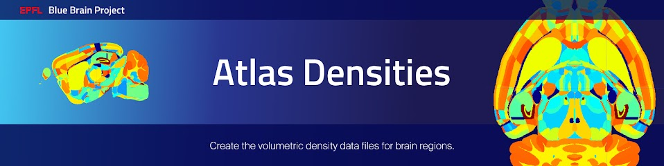

Overview
=========

This project contains the tools to create the volumetric density data files the `BBP Cell Atlas`_ is built on.
The creation of atlas files is the first step towards the creation of a circuit.

The tools implementation is based on the methods of `A Cell Atlas for the Mouse Brain`_ by Csaba Eroe et al., 2018.
The source code was originally written by Csaba Eroe, Dimitri Rodarie, Hugo Dictus, Lu Huanxiang, Wajerowicz Wojciech and Jonathan Lurie.

Atlas building tools operate on data files coming from the `Allen Institute for Brain Science (AIBS)`_.
These data files were obtained via experiments performed on P56 wild-type mouse brains.

The tools allow to:

* combine AIBS annotation files to reinstate missing mouse brain regions
* combine several AIBS gene marker datasets, to be used as hints for the spatial distribution of glia cells
* compute cell densities for several cell types including neurons and glia cells in the whole mouse brain

Tools can be used through a command line interface.

After installation, you can display the available command lines with the following ``bash`` command:
.. code-block:: bash

    atlas-densities --help

Installation
============

.. code-block:: bash

    git clone https://github.com/BlueBrain/atlas-densities
    cd atlas-densities
    pip install -e .

cgal-pybind
-----------
This project depends on the BBP python project cgal-pybind_.
The python project cgal-pybind_ needs to be installed prior to the above intructions.

Instructions for developers
===========================

Run the following commands before submitting your code for review:

.. code-block:: bash

    cd atlas-densities
    isort -l 100 --profile black atlas_densities tests setup.py
    black -l 100 atlas_densities tests setup.py

These formatting operations will help you pass the linting check `testenv:lint` defined in `tox.ini`.

Acknowledgements
================
The development of this software was supported by funding to the Blue Brain Project, a research center of the École polytechnique fédérale de Lausanne (EPFL), from the Swiss government’s ETH Board of the Swiss Federal Institutes of Technology.

For license and authors, see LICENSE.txt and AUTHORS.md respectively.

Copyright © 2021 Blue Brain Project/EPFL

.. _`Allen Institute for Brain Science (AIBS)`: https://alleninstitute.org/what-we-do/brain-science/
.. _`A Cell Atlas for the Mouse Brain`: https://www.frontiersin.org/articles/10.3389/fninf.2018.00084/full
.. _`BBP Cell Atlas`: https://portal.bluebrain.epfl.ch/resources/models/cell-atlas/
.. _cgal-pybind: TODO
.. _CGAL: https://www.cgal.org/
